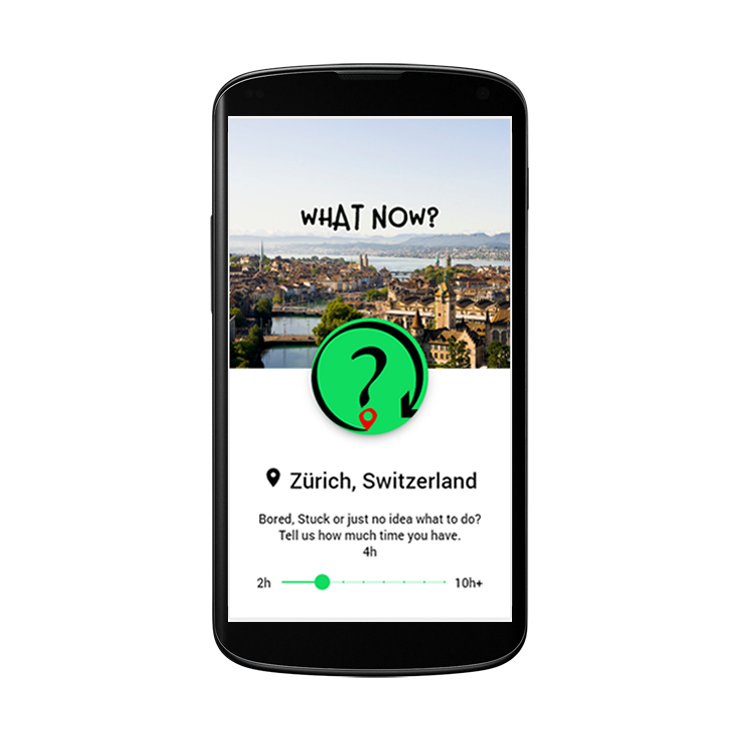

# WhatNow

## Inspiration
Imagine, you are in a city and you just got a message that your flight got delayed for several hours. Now what? This particularly user story of Swisscom’s challenge @ Hackzurich2019 got stuck in our head. Let’s be honest, we all know this situation all too well. Therefore, we need to find a solution that displays activities to spend this time well and not waste it. Additionally, who does not know the lazy Sunday afternoons that get boring after while, but we just do not know what to do. Wouldn’t it be nice, to have an app, where you just have to specify how much time you have, and it finds the most suitable events and travel destination reachable? 

## What it does
In a first step, the app gets the user's location. Secondly, the user can define how much time he/she has to spend on this particularly day. With this information, the app finds events and travel destinations that can be visited in the provided time span. 
The remaining events can be sorted by their cost and duration, allowing a user to select activities based on his/her personal preferences. 
An additional fun factor of the app is the integration of the surprise travels, powered by SBB. Spontaneous user have the possibility to get a ticket for an unknown destination reachable in the given time.
The user can choose such an adventure based on the duration and cost of the journey, which is immensely reduced thanks to super saver tickets.

## How we built it
With coffee, Ionic 4, not much sleep, some more coffee and love.

## Challenges we ran into
Using SBB API, working with incomplete event data.

## Accomplishments that we're proud of
* It's working
* It’s easy to use
* It’s beautiful
* Works like a charm
* Maybe has easter eggs

## What we learned
* Interaction with different APIs
* Working with current location

## What's next for WhatNow?
* Integrate events reachable by bike 
* Integrate CO2 Consumption
* Additional activities as hiking routes, cinema tickets, hotel stays and so on
* Display routes to event
* Integrate Google maps
